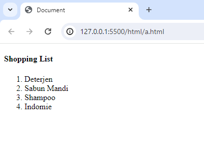
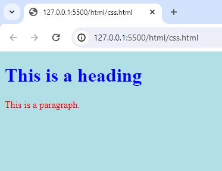
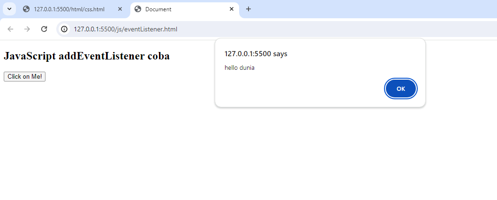

# Praktikum Web 1
# Tugas 2
Repositori ini berisi tugas 2 dari mata kuliah pemrograman web tentang:
- HTML
- CSS
- JavaScript
#Isi file
- Code HTML, CSS, JavaScript yang dipelajari di w3schools
- Beberapa Chalange/live koding yang di praktikum

## HTML
HTML(Hyper Text Markup Languages) Merupakan sebuah bahasa markup yang berfungsi sebagai kerangka website. HTML mendefinisikan struktur konten web dengan menggunakan element-elemen yang disebut tag.

Dokumen HTML dimulai dengan deklarasi DOCTYPE yang menentukan versi HTML yang digunakan, diikuti dengan elemen <html> sebagai akar dari dokumen. Di dalam <html>, terdapat elemen <head> untuk menyertakan informasi metadata seperti judul halaman dan elemen <body> untuk menampilkan konten yang terlihat oleh pengguna.

Contoh Struktur Dokumen HTML:

```html
<!DOCTYPE html>
<html lang="en">
<head>
    <meta charset="UTF-8">
    <meta name="viewport" content="width=device-width, initial-scale=1.0">
    <title>Judul Halaman Web Anda</title>
</head>
<body>
    <h1>Selamat Datang di Halaman Web Saya</h1>
    <p>Ini adalah contoh paragraf.</p>
</body>
</html>
```
Elemen HTML Umum
Beberapa elemen umum yang sering digunakan dalam HTML meliputi:

`<h1>`, `<h2>`, `<h3>`, `<h4>`, `<h5>`, `<h6>`: Elemen untuk heading (judul) dengan tingkat kepentingan yang berbeda.
`<p>`: Elemen untuk paragraf teks.
`<a>`: Elemen untuk membuat tautan (link) ke halaman lain.
``: Elemen untuk menampilkan gambar.
`<ul>`, `<ol>`, `<li>`: Elemen untuk membuat daftar tak berurutan (unordered list) dan berurutan (ordered list).
`<div>`, `<span>`: Elemen untuk mengelompokkan dan menambahkan gaya pada konten.

Berikut adalah contoh penulisan tag html, membuat ordered list:
```html
<h4>Shopping List</h4>
<ol>
  <li>Deterjen</li>
  <li>Sabun Mandi</li>
  <li>Shampoo</li>
  <li>Indomie</li>
</ol>

```

--
Bisa dilihat, dalam penulisan HTML text dibungkus sebuah tag container, aturan penulisan HTML hanya simple seperti tsb. untuk tagnya ada ol yang berfungsi untuk membungkus elemen li, tag ol berfungsi untuk membuat ordered list dan li sebagai isinya

## CSS
CSS(Cascading style sheet) adalah bahasa yang digunakan untuk menstyling/desain halaman website atau HTML yang telah kita buat. CSS mengontrol visualisasi elemen-elemen dengan mendefinisikan warna, tata letak(layout), dan lainya.
untuk contoh penulisanya sebagai berikut:
```sh
<!DOCTYPE html>
<html>
<head>
<style>
   body{
      background-color: powderblue;
   }

   h1{
      color: blue;
   }

   .paragraph{
      color: red;
   }
</style>
</head>
<body>

<h1>This is a heading</h1>
<p class="paragraph">This is a paragraph.</p>

</body>
</html>

```

--
Dengan CSS kita bisa merubah desain sebuah HTML seperti merubah warna text, warna background dan layouting. Untuk selectornya kita bisa langsung menggunakan tag, tapi paling umum digunakan yaitu menggunakan class, caranya dengan memberi class="" dulu di html lalu dipanggil di cssnya, untuk class di css depanya menggunakan titik(.)

## JavaScript
JavaScript adalah bahasa pemrograma yang digunakan untuk memberikan interaktivitas pada halaman web. Dengan JavaScript, kita dapat menangani kejadian (event), mengubah konten secara dinamis, dan berinteraksi dengan pengguna atau simplenya memanipulasi elemen-elemen yang ada di html, kita juga bisa memanipulasi stylenya atau CSSnya.
fungsi JavaScript disini berguna untuk memanilupasi elemen html dengan BOM atau DOM
- BOM(Browser Object Model)
  BOM (Browser Object Model) adalah bagian dari JavaScript yang menyediakan objek dan metode untuk berinteraksi dengan browser. BOM tidak diatur oleh standar resmi seperti DOM, tetapi sebagian besar browser mendukungnya.
  Objek Objek dalam BOM:
  - window object: Representasi dari jendela browser. Objek ini adalah objek root dalam BOM.
  - Document Object: Merupakan representasi dari dokumen HTML yang sedang dimuat di dalam jendela browser.
  - Location object: Menyediakan informasi tentang URL dari halaman yang sedang dimuat dan memungkinkan navigasi ke URL lain.
  - Navigator Object: Memberikan informasi tentang browser yang digunakan oleh pengguna.
  - Screen Object: Memberikan informasi tentang layar pengguna seperti lebar, tinggi, dan kedalaman warna.
  - History Object: Mengizinkan Anda berinteraksi dengan riwayat perambanan (browser) pengguna.
  --
  Contoh:
  ```sh
  <!DOCTYPE html>
  <html lang="en">
  <head>
      <meta charset="UTF-8">
      <meta name="viewport" content="width=device-width, initial-scale=1.0">
      <title>BOM Example</title>
  </head>
  <body>
      <h1>Contoh Penggunaan BOM</h1>
      
      <script>
          // Mendapatkan informasi browser dan layar
          var browserInfo = "Anda menggunakan " + navigator.appName + " versi " + navigator.appVersion;
          var screenWidth = "Lebar layar Anda adalah " + screen.width + " piksel";
        
          // Mengonfirmasi navigasi sebelum meninggalkan halaman
          window.onbeforeunload = function() {
              return "Anda yakin ingin meninggalkan halaman ini?";
          };
        
          // Mengarahkan pengguna ke halaman lain
          function redirect() {
              window.location.href = "https://www.google.com";
          }
      </script>
    
      <button onclick="redirect()">Pergi ke Google</button>
  </body>
  </html>
  ```
- DOM(Document Object Model)--
  DOM adalah platform dan antarmuka netral bahasa yang memungkinkan program dan skrip mengakses dan memperbarui konten, struktur, dan gaya dokumen secara dinamis.
  ```sh
  <!DOCTYPE html>
  <html lang="en">
  <head>
     <meta charset="UTF-8">
     <meta name="viewport" content="width=device-width, initial-scale=1.0">
     <title>Document</title>
  </head>
  <body>
    <h2>JavaScript addEventListener coba</h2> 

    <button id="tombol">Click on Me!</button>

     <script>
        document.getElementById('tombol').addEventListener('click', function(){
           alert('hello dunia');
        });
     </script>
  </body>
  </html>
  ```
  
  di code javascript berikut terdapat objek dom dengan method getElementById yang berfungsi untuk menangkap sebuah elemen dengan id tombol, setelah itu ada sebuah method event listener yang berfungsi mengatur event atau kejadian, sehingga jika id 'tombol' di klik akan memunculkan event alert
  
  atau kita bisa menaruh event di tag html
  ```sh
  <!DOCTYPE html>
  <html lang="en">
  <head>
     <meta charset="UTF-8">
     <meta name="viewport" content="width=device-width, initial-scale=1.0">
     <title>Document</title>
  </head>
  <body>
    <h2>JavaScript addEventListener coba</h2> 

    <button id="tombol" onclick="haloDunia()">Click on Me!</button>

     <script>
        function haloDunia(){
           alert('hello dunia');
        }
     </script>
  </body>
  </html>
  ```
